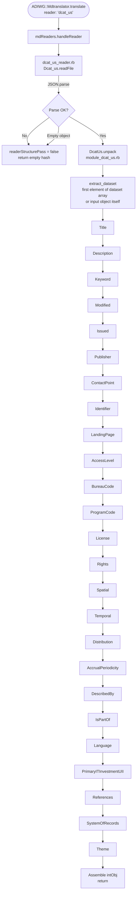
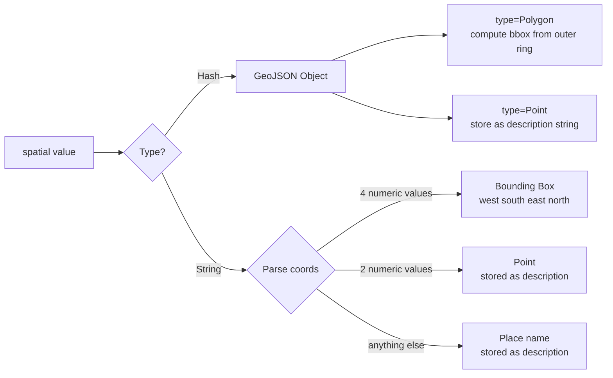
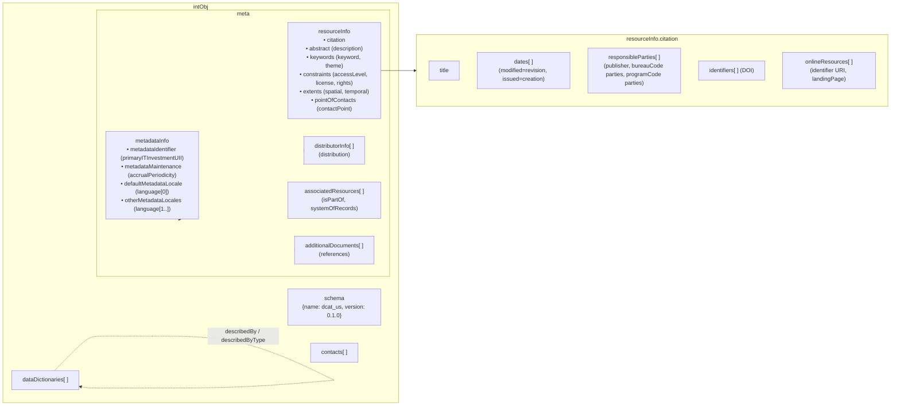

# DCAT-US Reader — Implementation Notes

**Standard:** DCAT-US Schema v1.1 (Project Open Data Metadata Schema)  
**Specification:** https://resources.data.gov/resources/dcat-us/  
**Reader key:** `dcat_us`  
**Version:** 0.1.0

---

## Overview

The `dcat_us` reader ingests a [DCAT-US Schema v1.1](https://resources.data.gov/resources/dcat-us/)
JSON document and translates it into the ADIwg mdTranslator internal object.  The reader follows
the same structural pattern as all other mdTranslator readers (e.g. `sbJson`, `fgdc`):

- A top-level `_reader.rb` entry point parses JSON and delegates to `modules/module_dcat_us.rb`.
- Each DCAT-US field has its own sub-module that performs one mapping responsibility.
- All modules write only to the internal object; they never touch the raw JSON after they
  have extracted their value.

---

## Supported Input Formats

| Input shape | Example |
|---|---|
| Full catalog with `dataset` array | `{ "conformsTo": "...", "dataset": [{...}] }` |
| Single dataset object | `{ "@type": "dcat:Dataset", "title": "..." }` |

When a catalog is supplied the reader processes only the **first** dataset in the array.
This is consistent with the DCAT-US writer, which serialises a single mdTranslator
internal object as one dataset.

---

## File Structure

```
lib/adiwg/mdtranslator/readers/dcat_us/
├── dcat_us_reader.rb          # Entry point – JSON parse + delegates to DcatUs.unpack
├── version.rb                 # VERSION = '0.1.0'
├── readme.md                  # Field mapping quick-reference
└── modules/
    ├── module_dcat_us.rb      # Orchestrator – calls every sub-module in order
    ├── module_title.rb
    ├── module_description.rb
    ├── module_keyword.rb
    ├── module_modified.rb
    ├── module_issued.rb
    ├── module_publisher.rb
    ├── module_contact_point.rb
    ├── module_identifier.rb
    ├── module_access_level.rb
    ├── module_bureau_code.rb
    ├── module_program_code.rb
    ├── module_distribution.rb
    ├── module_license.rb
    ├── module_rights.rb
    ├── module_spatial.rb
    ├── module_temporal.rb
    ├── module_periodicity.rb
    ├── module_described_by.rb
    ├── module_is_part_of.rb
    ├── module_language.rb
    ├── module_landing_page.rb
    ├── module_primary_it_investment_uii.rb
    ├── module_references.rb
    ├── module_system_of_records.rb
    └── module_theme.rb
```

```
test/readers/dcat_us/
├── dcat_us_test_parent.rb     # Shared minitest base class
├── testData/
│   ├── dataset_full.json      # Full DCAT-US catalog fixture (all fields)
│   └── dataset_minimal.json   # Minimal required-fields-only fixture
├── tc_dcat_us_title.rb
├── tc_dcat_us_description.rb
├── tc_dcat_us_keyword.rb
├── tc_dcat_us_modified.rb
├── tc_dcat_us_issued.rb
├── tc_dcat_us_publisher.rb
├── tc_dcat_us_contact_point.rb
├── tc_dcat_us_identifier.rb
├── tc_dcat_us_access_level.rb
├── tc_dcat_us_bureau_code.rb
├── tc_dcat_us_program_code.rb
├── tc_dcat_us_distribution.rb
├── tc_dcat_us_license.rb
├── tc_dcat_us_rights.rb
├── tc_dcat_us_spatial.rb
├── tc_dcat_us_temporal.rb
├── tc_dcat_us_language.rb
└── tc_dcat_us_landing_page.rb

test/translator/
├── tc_dcat_us_reader.rb       # End-to-end translator-level tests
└── testData/
    ├── dcat_us_catalog.json
    └── dcat_us_single_dataset.json
```

---

## Execution Flow



---

## Field Mapping Reference

### Always-Required Fields

| DCAT-US Field | Type | Internal Object Path | Notes |
|---|---|---|---|
| `title` | String | `metadata.resourceInfo.citation.title` | |
| `description` | String | `metadata.resourceInfo.abstract` | |
| `keyword` | Array\<String\> | `metadata.resourceInfo.keywords[0].keywords[].keyword` | All keywords placed in a single keyword group |
| `modified` | ISO 8601 | `metadata.resourceInfo.citation.dates[dateType=revision].date` | |
| `publisher.name` | String | `contacts[].name` (isOrganization=true) | also adds `responsibleParties[role=publisher]` to citation |
| `publisher.subOrganizationOf.name` | String | `contacts[].name` (parent org) | publisher contact gets `memberOfOrgs` pointing to parent contact |
| `contactPoint.fn` | String | `contacts[].name` | also adds `resourceInfo.pointOfContacts[role=pointOfContact]` |
| `contactPoint.hasEmail` | String | `contacts[].eMailList[0]` | `mailto:` prefix stripped |
| `identifier` | String (URI) | `citation.onlineResources[0].olResURI` | If URI contains `doi` → also added to `citation.identifiers[namespace=DOI]` |
| `accessLevel` | Enum | `resourceInfo.constraints[type=legal].legalConstraint.accessCodes` | see mapping table below |
| `bureauCode` | Array\<String\> | `contacts[externalIdentifier.namespace=bureauCode]` | one contact per code; adds `responsibleParties[role=bureau]` |
| `programCode` | Array\<String\> | `contacts[externalIdentifier.namespace=programCode]` | one contact per code; adds `responsibleParties[role=program]` |

#### `accessLevel` → ISO MD_RestrictionCode mapping

| DCAT-US value | Internal `accessCodes` value |
|---|---|
| `public` | `unclassified` |
| `restricted public` | `sensitiveButUnclassified` |
| `non-public` | `restricted` |

This mapping is the inverse of how the DCAT-US **writer** reads `accessCodes` back to produce
`accessLevel`, making round-trip translation lossless for these three values.

---

### If-Applicable Fields

| DCAT-US Field | Type | Internal Object Path | Notes |
|---|---|---|---|
| `distribution[].downloadURL` or `accessURL` | String | `metadata.distributorInfo[].distributor[0].transferOptions[0].onlineOptions[0].olResURI` | distributions without a URL are skipped |
| `distribution[].title` | String | `…onlineOptions[0].olResName` | |
| `distribution[].description` | String | `…distributorInfo[].description` | |
| `distribution[].mediaType` | String (MIME) | `…transferOptions[0].distributionFormats[0].formatSpecification.title` | |
| `distribution[].format` | String | `…transferOptions[0].unitsOfDistribution` | human-readable format label |
| `license` | String (URL) | `resourceInfo.constraints[type=use].reference[0].title` | |
| `rights` | String | `resourceInfo.constraints[type=use].releasability.statement` | |
| `spatial` | String or GeoJSON | `resourceInfo.extents[0].geographicExtents[0].boundingBox` | see spatial formats below |
| `temporal` | ISO 8601 interval | `resourceInfo.extents[0].temporalExtents[0].timePeriod` | |

---

### Optional (Expanded) Fields

| DCAT-US Field | Type | Internal Object Path |
|---|---|---|
| `issued` | ISO 8601 | `citation.dates[dateType=creation].date` |
| `accrualPeriodicity` | ISO 8601 repeating | `metadataInfo.metadataMaintenance.frequency` (mapped to text label) |
| `language` | Array\<String\> (RFC 5646) | first → `metadataInfo.defaultMetadataLocale.languageCode`; rest → `metadataInfo.otherMetadataLocales[].languageCode` |
| `landingPage` | String (URL) | `citation.onlineResources[olResFunction=landingPage].olResURI` |
| `describedBy` | String (URL) | `dataDictionaries[0].citation.onlineResources[0].olResURI` |
| `describedByType` | String (MIME) | `dataDictionaries[0].citation.onlineResources[0].olResProtocol` |
| `isPartOf` | String (URL) | `metadata.associatedResources[initiativeType=collection, associationType=collectiveTitle].resourceCitation.onlineResources[0].olResURI` |
| `primaryITInvestmentUII` | String | `metadataInfo.metadataIdentifier.identifier` |
| `references` | Array\<String\> | one `additionalDocuments[]` entry per URL, each with `citation[0].onlineResources[0].olResURI` |
| `systemOfRecords` | String (URL) | `metadata.associatedResources[initiativeType=sorn].resourceCitation.onlineResources[0].olResURI` |
| `theme` | Array\<String\> | `resourceInfo.keywords[thesaurus.title='ISO Topic Categories']` |

---

## Spatial Field Handling Detail

The DCAT-US spec allows four representations for `spatial`:



Bounding box coordinate order follows the DCAT-US v1.1 specification:
`minLongitude, minLatitude, maxLongitude, maxLatitude` (west, south, east, north).

---

## Internal Object Assembly Diagram



---

## `accrualPeriodicity` ISO 8601 → Frequency Label

| ISO 8601 value | Frequency label |
|---|---|
| `R/P10Y` | decennial |
| `R/P4Y` | quadrennial |
| `R/P3Y` | triennial |
| `R/P2Y` | biennial |
| `R/P1Y` | annual |
| `R/P6M` | semiannual |
| `R/P4M` | three times a year |
| `R/P3M` | quarterly |
| `R/P2M` | bimonthly |
| `R/P1M` | monthly |
| `R/P0.5M` | semimonthly |
| `R/P0.33M` | three times a month |
| `R/P2W` | biweekly |
| `R/P1W` | weekly |
| `R/P3.5D` | semiweekly |
| `R/P0.33W` | three times a week |
| `R/P1D` | daily |
| `R/PT1H` | hourly |
| `R/PT1S` | continuously updated |
| `irregular` | irregular |
| unknown value | stored as-is |

This mapping is the exact inverse of the `AccrualPeriodicity` builder in the DCAT-US writer
(`lib/adiwg/mdtranslator/writers/dcat_us/sections/dcat_us_accrualPeriodicity.rb`), which
ensures lossless round-trip for all standard values.

---

## How to Invoke

```ruby
require 'adiwg/mdtranslator'

json_str = File.read('my_catalog.json')

result = ADIWG::Mdtranslator.translate(
  file:   json_str,
  reader: 'dcat_us'
)

# Check results
puts result[:readerStructurePass]    # true if JSON parsed successfully
puts result[:readerExecutionPass]    # true if mapping completed without errors
puts result[:readerStructureMessages]
puts result[:readerExecutionMessages]
```

To translate DCAT-US → mdJson (for example):

```ruby
result = ADIWG::Mdtranslator.translate(
  file:   json_str,
  reader: 'dcat_us',
  writer: 'mdJson'
)

puts result[:writerOutput]
```

---

## Round-Trip Compatibility

The reader and writer share a common internal representation so that
`dcat_us → internal → dcat_us` produces equivalent output for all mapped fields.
Key design decisions that support round-trip fidelity:

| Decision | Rationale |
|---|---|
| `accessLevel` values mapped to ISO MD_RestrictionCode equivalents | The writer's `AccessLevel` builder reads `accessCodes` and maps back to the three DCAT-US strings using the same sets |
| Publisher contact stored with `isOrganization: true` and `roleName: publisher` | The writer's `Publisher` builder queries `responsibleParties` filtered by role |
| Bureau / program codes stored as `externalIdentifier[namespace=bureauCode\|programCode]` | The writer's `BureauCode` / `ProgramCode` builders filter contacts by this namespace |
| `accrualPeriodicity` stored as human-readable label | The writer maps labels back to ISO 8601 using the same table |
| `landingPage` stored with `olResFunction: 'landingPage'` | The writer's `LandingPage` builder filters `onlineResources` by this function |
| `isPartOf` stored as `initiativeType: 'collection'` | The writer's `IsPartOf` builder filters `associatedResources` by this initiative type |
| `systemOfRecords` stored as `initiativeType: 'sorn'` | The writer's `SystemOfRecords` builder filters by this initiative type |

---

## Test Suite Summary

Each sub-module has a dedicated minitest class covering three scenarios:

| Test scenario | What it checks |
|---|---|
| **complete** | All relevant fixture fields present → correct internal object values |
| **empty / null** | Field present but empty/null → no mapping written, no error raised |
| **missing** | Field absent entirely → no mapping written, no error raised |

The translator-level tests (`test/translator/tc_dcat_us_reader.rb`) additionally verify:

- Invalid JSON sets `readerStructurePass = false`
- Empty object `{}` sets `readerStructurePass = false` with a message
- A full catalog JSON parses successfully (`readerStructurePass = true`)
- A single dataset JSON (no `dataset` wrapper) parses successfully
- `VERSION` constant equals `'0.1.0'`

---

## Known Limitations / Future Work

| Item | Detail |
|---|---|
| Multi-dataset catalogs | Only the **first** dataset in the `dataset` array is processed. A future enhancement could iterate all datasets. |
| `dataQuality` field | DCAT-US boolean `dataQuality` has no direct home in the current internal object schema and is not mapped. |
| `conformsTo` (dataset level) | No direct mapping exists in the internal object for a dataset-level standards conformance URI. |
| `identifier` as plain string | Only URI-style identifiers are tested. Agencies sometimes use opaque local strings; these are stored as online resources without a DOI namespace identifier. |
| GeoJSON string-encoded spatial | The spec allows `spatial` to be a JSON-encoded string (`"\"{\"type\":\"Point\"...}""`). The reader handles Hash and String inputs; doubly-encoded strings are treated as place names. |
